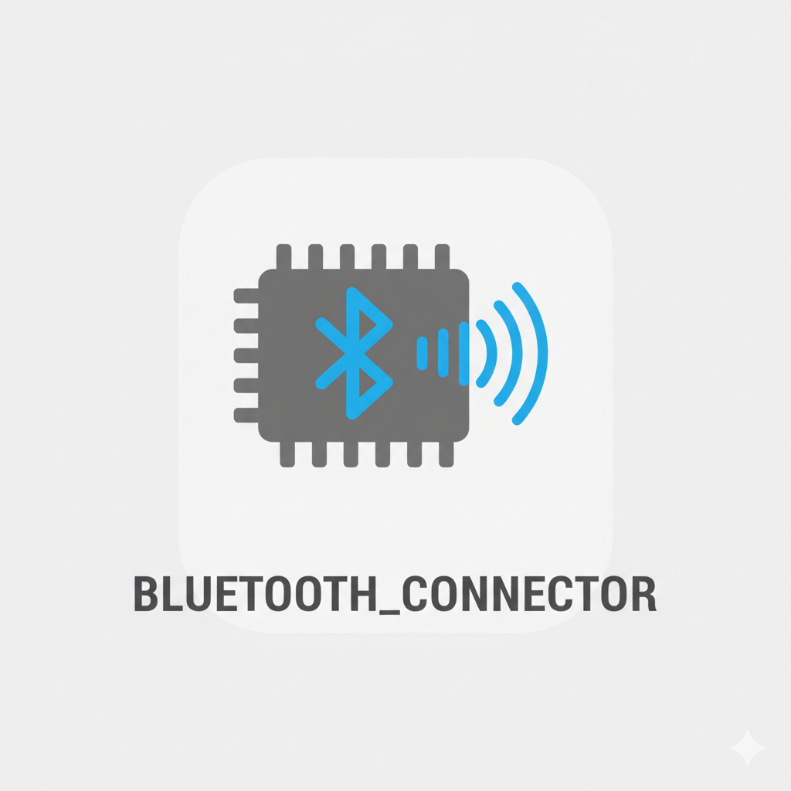

<div id="top">

<div align="center">



# BLUETOOTH_CONNECTOR.GIT

<em></em>


</div>
<br>

---
<!-- default option, no dependency badges. -->


<!-- default option, no dependency badges. -->

</div>
<br>

---

## Table of Contents

- [Table of Contents](#table-of-contents)
- [Overview](#overview)
- [Features](#features)
- [Project Structure](#project-structure)
    - [Project Index](#project-index)
- [Getting Started](#getting-started)
    - [Prerequisites](#prerequisites)
    - [Installation](#installation)
    - [Usage](#usage)
    - [Testing](#testing)
- [Roadmap](#roadmap)
- [Contributing](#contributing)
- [License](#license)
- [Acknowledgments](#acknowledgments)

---

## Overview


## Features

<code>❯ Audio Generation with binaries </code>

<code>❯ Bluetooth Connection and audio stream over BT A2DP </code>

<code>❯ Serial comm with MSP430 for Digital Signal Processing </code>


---

## Project Structure

```sh
└── bluetooth_connector.git/
    ├── include
    │   └── README
    ├── lib
    │   └── README
    ├── platformio.ini
    ├── src
    │   └── main.cpp
    └── test
        └── README
```

### Project Index

<details open>
	<summary><b><code>BLUETOOTH_CONNECTOR.GIT/</code></b></summary>
	<!-- __root__ Submodule -->
	<details>
		<summary><b>__root__</b></summary>
		<blockquote>
			<div class='directory-path' style='padding: 8px 0; color: #666;'>
				<code><b>⦿ __root__</b></code>
			<table style='width: 100%; border-collapse: collapse;'>
			<thead>
				<tr style='background-color: #f8f9fa;'>
					<th style='width: 30%; text-align: left; padding: 8px;'>File Name</th>
					<th style='text-align: left; padding: 8px;'>Summary</th>
				</tr>
			</thead>
				<tr style='border-bottom: 1px solid #eee;'>
					<td style='padding: 8px;'><b><a href='https://github.com/RodrigofrBastos/bluetooth_connector.git/blob/master/platformio.ini'>platformio.ini</a></b></td>
					<td style='padding: 8px;'>Code>❯ REPLACE-ME</code></td>
				</tr>
			</table>
		</blockquote>
	</details>
	<!-- src Submodule -->
	<details>
		<summary><b>src</b></summary>
		<blockquote>
			<div class='directory-path' style='padding: 8px 0; color: #666;'>
				<code><b>⦿ src</b></code>
			<table style='width: 100%; border-collapse: collapse;'>
			<thead>
				<tr style='background-color: #f8f9fa;'>
					<th style='width: 30%; text-align: left; padding: 8px;'>File Name</th>
					<th style='text-align: left; padding: 8px;'>Summary</th>
				</tr>
			</thead>
				<tr style='border-bottom: 1px solid #eee;'>
					<td style='padding: 8px;'><b><a href='https://github.com/RodrigofrBastos/bluetooth_connector.git/blob/master/src/main.cpp'>main.cpp</a></b></td>
					<td style='padding: 8px;'>Code>❯ REPLACE-ME</code></td>
				</tr>
			</table>
		</blockquote>
	</details>
</details>

---

## Getting Started

### Prerequisites

This project requires the following dependencies:

- **Programming Language:** CPP
- **IDE:** `VScode` with `PlatformIO` extension installed

### Installation

Build bluetooth_connector.git from the source and intsall dependencies:

1. **Clone the repository:**

    ```sh
    ❯ git clone https://github.com/RodrigofrBastos/bluetooth_connector.git
    ```

2. **Navigate to the project directory:**

    ```sh
    ❯ cd bluetooth_connector.git
    ```

3. **Install the dependencies:**

    ```sh
    ❯ INSTALL CMD HERE
    ```

### Usage

Run the project with:


### Testing

Bluetooth_connector.git uses the {__test_framework__} test framework. Run the test suite with:

echo 'INSERT-TEST-COMMAND-HERE'

## Contributing

- **💬 [Join the Discussions](https://github.com/RodrigofrBastos/bluetooth_connector.git/discussions)**: Share your insights, provide feedback, or ask questions.
- **🐛 [Report Issues](https://github.com/RodrigofrBastos/bluetooth_connector.git/issues)**: Submit bugs found or log feature requests for the `bluetooth_connector.git` project.
- **💡 [Submit Pull Requests](https://github.com/RodrigofrBastos/bluetooth_connector.git/blob/main/CONTRIBUTING.md)**: Review open PRs, and submit your own PRs.

<details closed>
<summary>Contributing Guidelines</summary>

1. **Fork the Repository**: Start by forking the project repository to your github account.
2. **Clone Locally**: Clone the forked repository to your local machine using a git client.
   ```sh
   git clone https://github.com/RodrigofrBastos/bluetooth_connector.git
   ```
3. **Create a New Branch**: Always work on a new branch, giving it a descriptive name.
   ```sh
   git checkout -b new-feature-x
   ```
4. **Make Your Changes**: Develop and test your changes locally.
5. **Commit Your Changes**: Commit with a clear message describing your updates.
   ```sh
   git commit -m 'Implemented new feature x.'
   ```
6. **Push to github**: Push the changes to your forked repository.
   ```sh
   git push origin new-feature-x
   ```
7. **Submit a Pull Request**: Create a PR against the original project repository. Clearly describe the changes and their motivations.
8. **Review**: Once your PR is reviewed and approved, it will be merged into the main branch. Congratulations on your contribution!
</details>

<details closed>
<summary>Contributor Graph</summary>
<br>
<p align="left">
   <a href="https://github.com{/RodrigofrBastos/bluetooth_connector.git/}graphs/contributors">
      
   </a>
</p>
</details>

---

## License

Bluetooth_connector.git is protected under the [LICENSE](https://choosealicense.com/licenses) License. For more details, refer to the [LICENSE](https://choosealicense.com/licenses/) file.

---

## Acknowledgments

- Credit `contributors`, `inspiration`, `references`, etc.

<div align="right">

[![][back-to-top]](#top)

</div>


[back-to-top]: https://img.shields.io/badge/-BACK_TO_TOP-151515?style=flat-square


---
